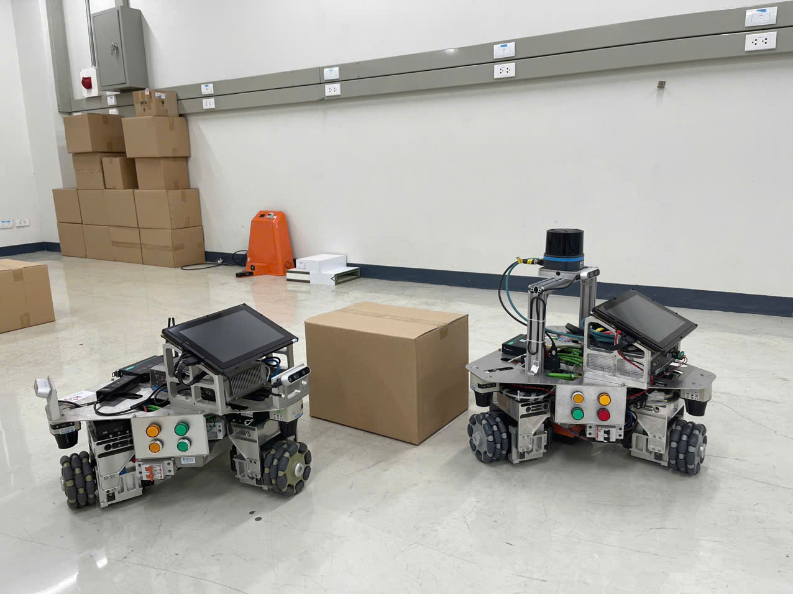
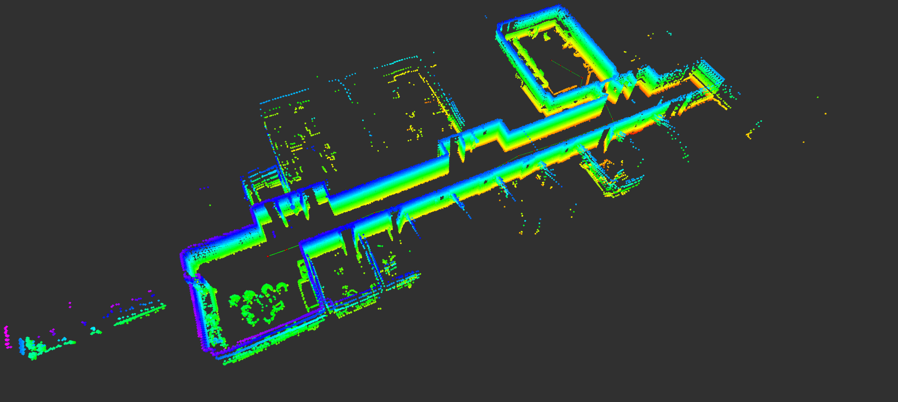

# 3D SLAM

## Introduction

## References
- [Graph-based slam](http://www2.informatik.uni-freiburg.de/~stachnis/pdf/grisetti10titsmag.pdf)

- [KISS ICP](https://www.ipb.uni-bonn.de/wp-content/papercite-data/pdf/vizzo2023ral.pdf)

## Hardware - VK-OMNI ROBOT used SICK Multiscan with 16 layers

## Testing Enviroment

## Installation and Usage

---

Let me know if you’d like me to refine anything or add more details! 🚀

